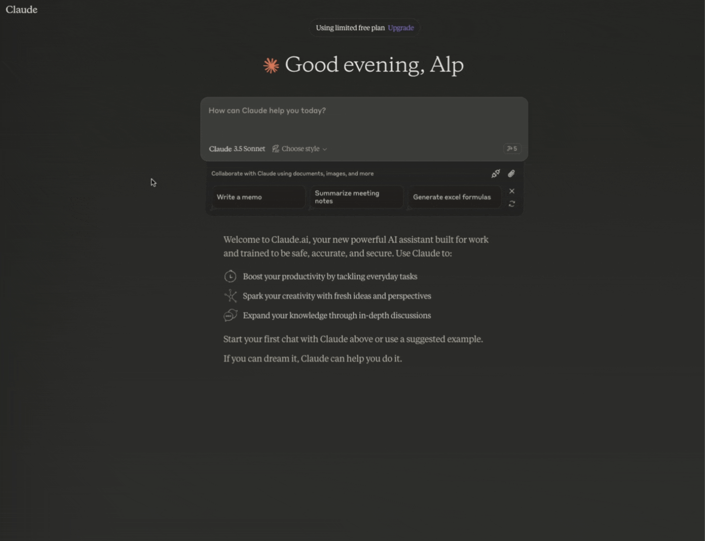
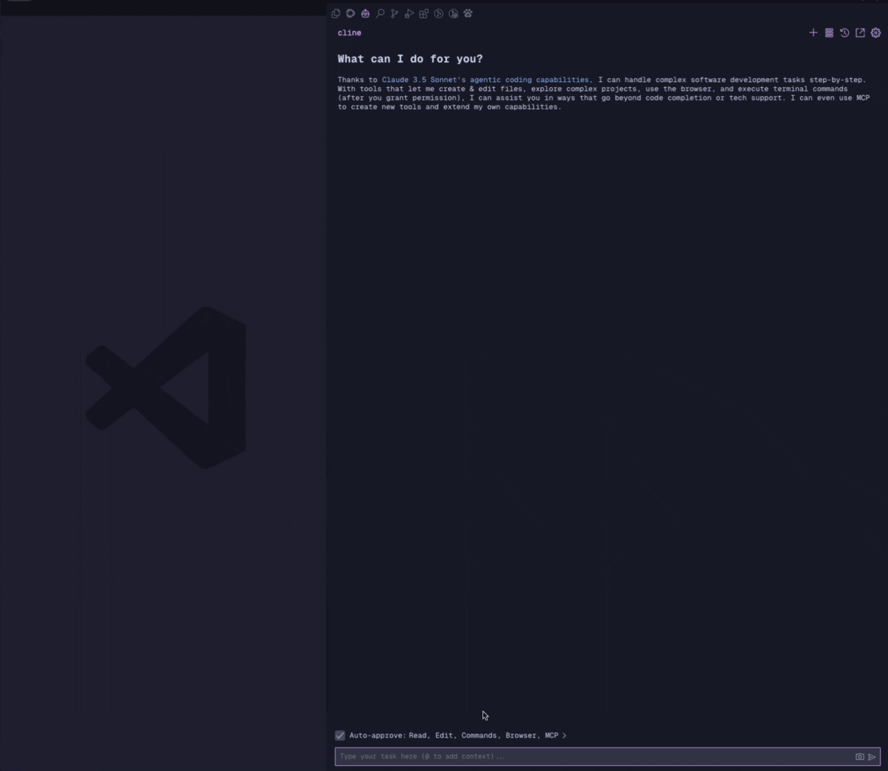

[](https://mseep.ai/app/ravenwits-mcp-server-arangodb)

# MCP Server for ArangoDB

[](https://smithery.ai/server/@ravenwits/mcp-server-arangodb)

A Model Context Protocol server for ArangoDB

This is a TypeScript-based MCP server that provides database interaction capabilities through ArangoDB. It implements core database operations and allows seamless integration with ArangoDB through MCP tools. You can use it wih Claude app and also extension for VSCode that works with mcp like Cline!

## Features

### Tools

- `arango_query` - Execute AQL queries

  - Takes an AQL query string as required parameter
  - Optionally accepts bind variables for parameterized queries
  - Returns query results as JSON

- `arango_insert` - Insert documents into collections

  - Takes collection name and document object as required parameters
  - Automatically generates document key if not provided
  - Returns the created document metadata

- `arango_update` - Update existing documents

  - Takes collection name, document key, and update object as required parameters
  - Returns the updated document metadata

- `arango_remove` - Remove documents from collections

  - Takes collection name and document key as required parameters
  - Returns the removed document metadata

- `arango_backup` - Backup all collections to JSON files

  - Takes output directory path as required parameter
  - Creates JSON files for each collection with current data
  - Useful for data backup and migration purposes

- `arango_list_collections` - List all collections in the database

  - Returns array of collection information including names, IDs, and types

- `arango_create_collection` - Create a new collection in the database
  - Takes collection name as required parameter
  - Optionally specify collection type (document or edge collection)
  - Configure waitForSync behavior for write operations
  - Returns collection information including name, type, and status

## Installation

### Installing via NPM

To install `arango-server` globally via NPM, run the following command:

```bash
npm install -g arango-server
```

### Running via NPX

To run `arango-server` directly without installation, use the following command:

```bash
npx arango-server
```

### Configuring for VSCode Agent

To use `arango-server` with the VSCode Copilot agent, you must have at least **VSCode 1.99.0 installed** and follow these steps:

1. **Create or edit the MCP configuration file**:

   - **Workspace-specific configuration**: Create or edit the `.vscode/mcp.json` file in your workspace.
   - **User-specific configuration**: Optionally, specify the server in the [setting(mcp)](vscode://settings/mcp) VS Code [user settings](https://code.visualstudio.com/docs/getstarted/personalize-vscode#_configure-settings) to enable the MCP server across all workspaces.

     _Tip: You can refer [here](https://code.visualstudio.com/docs/copilot/chat/mcp-servers) to the MCP configuration documentation of VSCode for more details on how to set up the configuration file._

2. **Add the following configuration**:

   ```json
   {
   	"servers": {
   		"arango-mcp": {
   			"type": "stdio",
   			"command": "npx",
   			"args": ["arango-server"],
   			"env": {
   				"ARANGO_URL": "http://localhost:8529",
   				"ARANGO_DB": "v20",
   				"ARANGO_USERNAME": "app",
   				"ARANGO_PASSWORD": "75Sab@MYa3Dj8Fc"
   			}
   		}
   	}
   }
   ```

3. **Start the MCP server**:

   - Open the Command Palette in VSCode (`Ctrl+Shift+P` or `Cmd+Shift+P` on Mac).
   - Run the command `MCP: Start Server` and select `arango-mcp` from the list.

4. **Verify the server**:
   - Open the Chat view in VSCode and switch to Agent mode.
   - Use the `Tools` button to verify that the `arango-server` tools are available.

### Installing via Smithery

To install ArangoDB for Claude Desktop automatically via [Smithery](https://smithery.ai/server/@ravenwits/mcp-server-arangodb):

```bash
npx -y @smithery/cli install @ravenwits/mcp-server-arangodb --client claude
```

#### To use with Claude Desktop

Go to: `Settings > Developer > Edit Config` or

- MacOS: `~/Library/Application Support/Claude/claude_desktop_config.json`
- Windows: `%APPDATA%/Claude/claude_desktop_config.json`

#### To use with Cline VSCode Extension

Go to: `Cline Extension > MCP Servers > Edit Configuration` or

- MacOS: `~/Library/Application Support/Code/User/globalStorage/cline.cline/config.json`
- Windows: `%APPDATA%/Code/User/globalStorage/cline.cline/config.json`

Add the following configuration to the `mcpServers` section:

```json
{
	"mcpServers": {
		"arango": {
			"command": "node",
			"args": ["/path/to/arango-server/build/index.js"],
			"env": {
				"ARANGO_URL": "your_database_url",
				"ARANGO_DB": "your_database_name",
				"ARANGO_USERNAME": "your_username",
				"ARANGO_PASSWORD": "your_password"
			}
		}
	}
}
```

### Environment Variables

The server requires the following environment variables:

- `ARANGO_URL` - ArangoDB server URL (note: 8529 is the default port for ArangoDB for local development)
- `ARANGO_DB` - Database name
- `ARANGO_USERNAME` - Database user
- `ARANGO_PASSWORD` - Database password

## Usage

You can pretty much provide any meaningful prompt and Claude will try to execute the appropriate function.

Some example propmts:

- "List all collections in the database"
- "Query all users"
- "Insert a new document with name 'John Doe' and email "<john@example.com>' to the 'users' collection"
- "Update the document with key '123456' or name 'Jane Doe' to change the age to 48"
- "Create a new collection named 'products'"

### Usage with Claude App



### Uasge with Cline VSCode extension



Query all users:

```typescript
{
  "query": "FOR user IN users RETURN user"
}
```

Insert a new document:

```typescript
{
  "collection": "users",
  "document": {
    "name": "John Doe",
    "email": "john@example.com"
  }
}
```

Update a document:

```typescript
{
  "collection": "users",
  "key": "123456",
  "update": {
    "name": "Jane Doe"
  }
}
```

Remove a document:

```typescript
{
  "collection": "users",
  "key": "123456"
}
```

List all collections:

```typescript
{
} // No parameters required
```

Backup database collections:

```typescript
{
  "outputDir": "./backup" // Specify an absolute output directory path for the backup files (optional)
  "collection": "users" // Specify a collection name to backup (optional) If no collection name is provided, all collections will be backed up
  "docLimit": 1000 // Specify the maximum number of documents to backup per collection (optional), if not provided, all documents will be backed up (not having a limit might cause timeout for large collections)
}
```

Create a new collection:

```typescript
{
  "name": "products",
  "type": "document", // "document" or "edge" (optional, defaults to "document")
  "waitForSync": false // Optional, defaults to false
}
```

Note: The server is database-structure agnostic and can work with any collection names or structures as long as they follow ArangoDB's document and edge collection models.

## Disclaimer

### For Development Use Only

This tool is designed for local development environments only. While technically it could connect to a production database, this would create significant security risks and is explicitly discouraged. We use it exclusively with our development databases to maintain separation of concerns and protect production data.

## Development

1. Clone the repository
2. Install dependencies:

   ```bash
   npm run build
   ```

3. For development with auto-rebuild:

   ```bash
   npm run watch
   ```

### Debugging

Since MCP servers communicate over stdio, debugging can be challenging. recommended debugging can be done by using [MCP Inspector](https://github.com/modelcontextprotocol/inspector) for development:

```bash
npm run inspector
```

The Inspector will provide a URL to access debugging tools in your browser.

## License

This project is licensed under the MIT License - see the [LICENSE](LICENSE) file for details.
